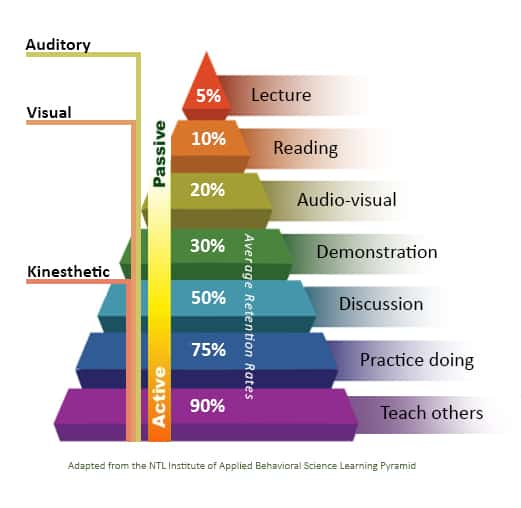
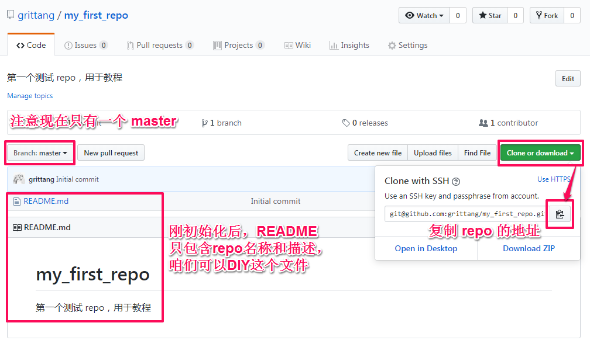
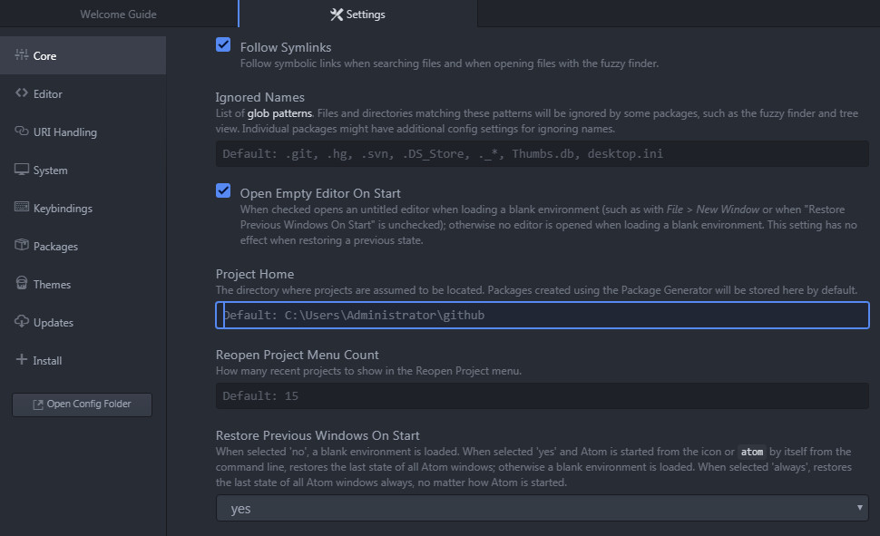
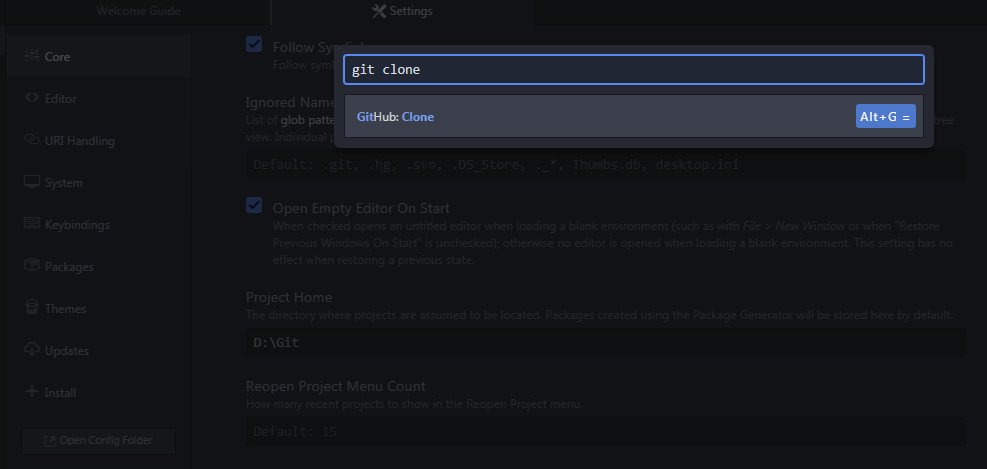
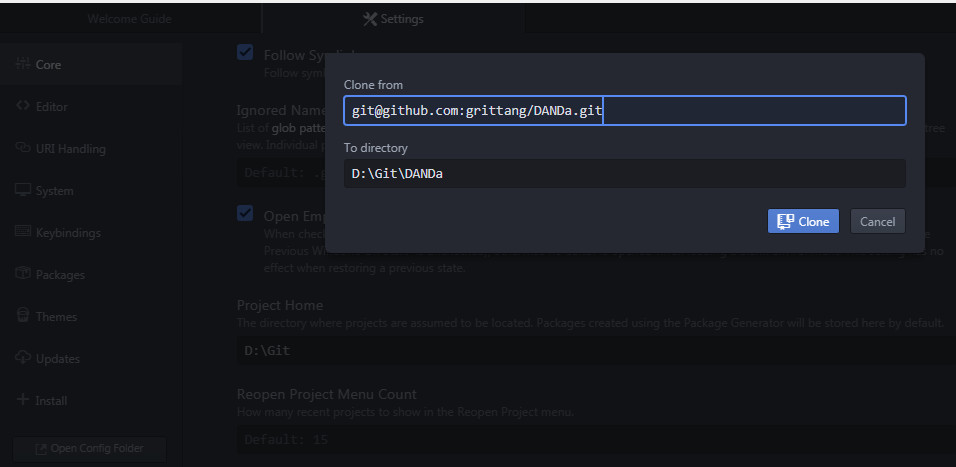
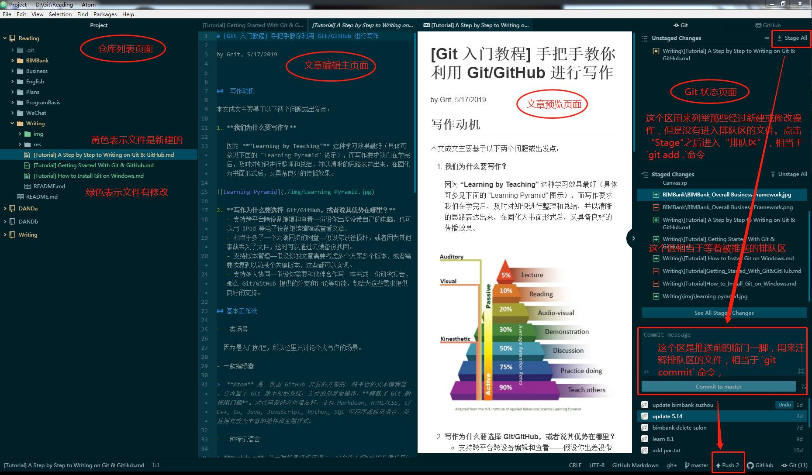

# [Git 入门教程] 手把手教你利用 Git/GitHub 进行写作

by Grit, 5/17/2019

[TOC]

##  1. 写作动机

如果把 Git/GitHub 写作看到一道菜，那么在各色菜式中，为什么独独要选择这么一道菜？本文成文主要基于以下两个问题或出发点：

- **我们为什么要写作？**

因为 **“Learning by Teaching"** 这种学习效果最好（具体可参见下面的 "Learning Pyramid" 图示），而写作要求我们在学完后，及时对知识进行整理和总结，并以清晰的思路表达出来，在固化为书面形式后，又具备良好的传播效果。

- **写作为什么要选择 Git/GitHub，或者说其优势在哪里？**
  - 支持跨平台跨设备编辑和查看——假设你出差没带自己的电脑，也可以用 iPad 等电子设备继续编辑或查看文章。
  - 相当于多了一个云端同步的网盘——假设你设备损坏，或者因为其他事故丢失了文件，这时可以通过云端备份找回。
  - 支持版本管理——假设你的文章需要考虑多个方案多个版本，或者需要恢复到以前某个关键版本，这些都可以实现。
  - 支持多人协同——假设你需要和伙伴合作写一本书或一份研究报告，那么 Git/GitHub 提供的分支和评论等功能，都给为这些需求提供良好的支持。

## 2. 基本工作流

这里要回答的是，这道菜适合在什么情况下点？烹饪思路是怎样的？需要备齐哪些关键的厨具？

- 一类场景

  因为是入门教程，所以这里只讨论个人写作的场景。

- 一款编辑器

>  **Atom** 是一款由 GitHub 开发的开源的、跨平台的文本编辑器，它内置了 Git 版本控制系统，支持图形界面操作，**降低了 Git 的使用门槛**。对代码爱好者也很友好，支持 Markdown, HTML/CSS, C/C++, Go, Java, JavaScript, Python, SQL 等程序或标记语言，而且拥有较为丰富的插件和主题样式。

- 一种标记语言

> **Markdown** 是一种轻量级标记语言，它允许人们“使用易读易写的纯文本格式编写文档，然后转换成有效的 XHTML/HTML 文档”，并且对于图片，图表，数学表达式都能提供支持。通俗地说，Markdown 通过纯文本和几个简单的符号就能搞定一份图文并茂的文章（比如你现在看的这篇，哈）。所以本文仅讨论通过 Markdown 进行写作的方法。

- 两条工作流
  - 以 Atom 为核心的写作工作流——因 [Atom]([https://atom.io](https://atom.io/)) 同时集成了 Markdown 和 Git/GitHub，大大提高了写作效率和使用门槛，所以**本文仅讨论这条工作流，即配置 Atom 工作环境 ——> Git 仓库初始化 ——> Markdown 写作 ——> Git 推送写作成果。**
  - 其他 Markdown 编辑器 + Git/GitHub 的写作工作流——这条工作流的写作环境相对分散，导致效率和学习曲线相对陡峭。如果你想不方便使用 Atom，那么推荐将 [Typora](https://typora.io/) 作为首选 Markdown 编辑器，而 Git/GitHub 的基本操作可以参考本系列教程中的另一篇文章，即[《[Git 入门教程] 手把手教你玩转 Git/GitHub》]([Git Tutorial] Getting Started With Git & GitHub.md)。

## 3. Atom 环境配置

从这里开始介绍实操，在你刚搬进写作新家的时候，首先要做的当然是购买各种厨具啦：

- 创建 GitHub 账户

​	如果不会，请依然参考[《[Git 入门教程] 手把手教你玩转 Git/GitHub》]([Git Tutorial] Getting Started With Git & GitHub.md)，不再废话啦。

- 安装 Atom 

​	下载链接（2019 年 5 月最新版）：https://pan.baidu.com/s/1KnywXVqOLOge4jUNTsY9ZQ 
​	提取码：tf04 

- 连接 GitHub 账户

​	完成安装后，先在网页上登录 GitHub 账户。在软件右边的 GitHub 面板点击”连接“按钮，这时提示需要 GitHub 授权密钥，随之跳转到 GitHub 生成密钥，复制密钥到 Atom 即连接成功。此时宣告 Atom 环境配置妥当。

## 4. Git 仓库初始化

接着，需要对关键厨具进行预处理：

- 在 GitHub 网页专门创建一个用于存储写作成果的仓库

- 利用`git clone`命令克隆写作仓库到本地

  - 从 GitHub 网站复制仓库地址——进入到目标仓库的页面后，点击右侧复制地址的按钮，如下图所示：

    

  - 设定 Atom 上的默认文件夹—— Project 文件夹是用来存储仓库的，它的默认位置在 C 盘。如果你想改变位置，只需在 Setting 里面改成你要想的目标文件夹，如下图：

    

  - 调用 Command，定位到 Clone 命令——利用快捷键`Ctrl + Shift + P`或从`Packages`菜单栏进入`Command Palette`界面，输入`git clone`快速定位到`GitHub: Clone`命令，如下图所示：

    

  - 调用 Clone 命令，完成复制——承接上一步骤，输入`git clone`后回车，弹出从远程库 Clone 的对话框，输入第一步中复制的仓库地址即可复制到本地：

    

  -  另外：如果你之前用 Git 客户端 clone repo 到本地，那么利用 Atom 的“添加项目文件夹”命令（快键键 Ctrl + Shift + A），将已经克隆到本地的 repo 添加进 Atom。这样也可以在 Atom 软件上完成了仓库的初始化。

## 5. Markdown 写作

从这里开始就可以准备下锅啦，正式开动写作大脑吧！

可能有小伙伴之前没用过 Markdown，没关系，学习门槛极低，对着这篇 [Markdown 中文教程](https://www.zybuluo.com/mdeditor)，边看边写，即刻上手！或者像查字典一样查找这个表格 [Cheat Sheet: A quick reference to the Markdown syntax.](A quick reference to the Markdown syntax.)

> 特别提醒，在 Markdown 文件中插入外部文件或图片时，千万注意两点：
>
> - 采用 **“相对路径法”** 插入，可以实现 Markdown 编辑器和 GitHub 之间的完美衔接。比如文章开头插入的图片 "learning_pyramid.jpg"，可以在根目录下新建一个文件夹 `img`, 将所有需要引用的图片都放在 `img` 文件夹里边，引用的语法就变成了 `img/learning_pyramid.jpg`，也就是图片的相对路径；
> - 插入的文件或图片的**名称中绝对不能出现空格**，否则在 GitHub 上不能正常显示（虽然在一些 Markdown 可以正常显示）。比如上面图片的名称是`learning_pyramid.jpg`，而不能是 `learning pyramid.jpg`。

如果在写作的过程中想要随时预览，可利用快捷键`Ctrl + Shift + M`进行切换；如果不能预览文章，那么需要安装 [markdown-preview](https://atom.io/packages/markdown-preview) 这个插件。

## 6. Git 推送写作成果

接下来就是收汁出锅啦！通过依次点击箭头上的几个按钮来推送更新内容，这几个按钮分别对应 `git add`, `git commit`和 `git push` 这三个命令。

## 7. 常规流程

平时炒菜的时候，当然不需要上面那么多复杂的步骤，因为在完成所有的初始化和预处理环节之后，你已经为新家打造出了一个完美厨房。每次当你想要下厨（写作）了，只要你准备好新鲜食材（写作素材），就只管进厨房一展身手好了！**因此，日常创作只需要 “4-5-6” 这三部曲就够啦，如果你把同类的文章放到一个仓库里边，那么步骤 4 也可以免了。**

BTW. 这篇文章就是“现身说法”，如果你有兴趣，可以将本文下载到本地，当然外部引用的图片也要下载，并且存放在 `img`文件夹中。

(完)

## 相关链接

- [[Git 入门教程] 手把手教你把玩 Git/GitHub]([Git_Tutorial]_Getting_Started_With_Git&GitHub.md)
- [[Git 入门教程] 手把手教你安装 Git (Windows 平台)]([Git_Tutorial]_How_to_Install_Git_on_Windows.md)

