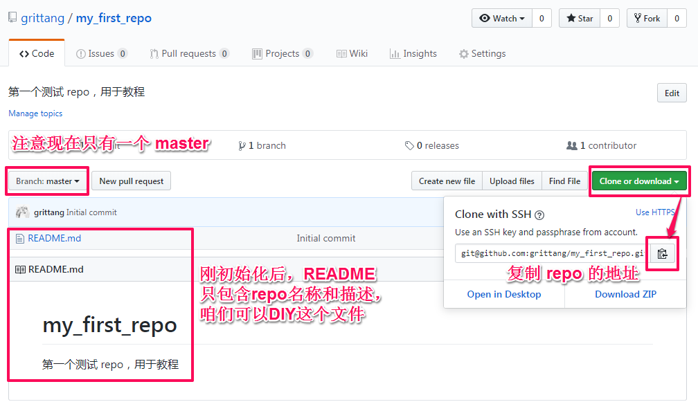

# [Git 入门教程] 手把手教你玩转 Git/GitHub

by Grit, 4/21/2019

导语：写这个教程呢，是为了贯彻“分享是最好的学习”的方法论。教程将介绍 GitHub 的相关概念、安装方法，以及托管代码的基操。面对的对象是纯小白，大神请前面右拐哈。

先让我们想象这么几个场景：

> Scene 1: 我目前正在做一个小小的教育项目，就是教一群小伙伴学 Python，需要共享源代码，方便小伙伴随时取用；每天我都会更新章节和增加新的代码，稳步推荐教育节奏；要是有一个教学论坛，大家可以对某段代码进行提问或讨论，那就更好了；偶尔我忙不过来了，也需要有助教帮忙更新代码。

> Scene 2: 除了代码，我也喜欢写点东西，这不最近正计划和好基友一起写书呢。要是能找到一个一起写书的在线写作平台就好了。

> Scene 3: 我有做读书笔记的习惯，但是很多和工作相关的资料都是每天看一点记一点，有时候在公司看完记完之后，回家还想接着做。

## 1. Git & GitHub

### 1.1 功能需求

OK，如果要为上面的场景开发一款产品，让我们先琢磨一下这个产品需要具备哪些基本功能呢？

- 云端托管——咱得先把代码上云不是？这样做的好处就是，一旦同步到云端后，你可以随时随地联网，通过各种不同终端访问你的代码啦，很像百度网盘对吗？
- 版本控制——单是把代码文件上传到网盘可不行，咱们是不是还希望更新文件版本呢？如果能把每一个版本都存下来，而且可以选择“回滚”到想要的那个版本，是不是就更 Gelivable 了呢？这就是版本控制了。
- 协同工作——很多时候，咱会希望和“道友”合作开发一个项目，而开源项目更是需要N多人参与，正所谓众人拾柴那啥高嘛，所以协作也是必备的功能之一呢。

### 1.2 功能实现

上面的几个重要特性可以通过 Git 和 GitHub 这对黄金拍档来实现。简单说来，Git 是一个版本控制软件，而 GitHub 是一个在线协作的 Git 仓库托管平台。

> 重要提示：接下来介绍怎么在WIN平台上安装 Git，如果你已经安装或者驾轻就熟，请直接跳到第 3 步！

## 2. 安装 Git 软件

- [在 Windows 平台上安装 Git]([Tutorial]How_to_Install_Git_on_Windows.md)

- [在 Mac 平台上安装 Git](<https://www.atlassian.com/git/tutorials/install-git#mac-os-x>)

- [在 Linux 平台上安装 Git](<https://www.atlassian.com/git/tutorials/install-git#linux>)

  

## 3. 开始托管项目到 GitHub (GitHub Workflow)

至此，咱们的 Git 终于能认出本地电脑了，巴特还~不~够！因为 Git 是以**仓库 (即 Repository, 简称 Repo)** 为单位来进行项目操作的，也就是说“一个萝卜一个坑”，啊呸，“一个项目一个repo"。

打个比方，上面已经在两个工厂之间签订了合作协议，但是在项目或仓库的层面还是井水不犯河水的。工厂A允许工厂B入园参观，但是各个仓库目前都还是保密的。建立仓库层面的联系（即 repo 的 initialize)，才可以允许对方使用开放了权限的仓库。

>  **GitHub 的典型工作流是这样的：**
>
>  **建库 ——> 分支 ——> 提交 ——> 同步 ——> 协作 ——> 合并**

### 3.1 建库 (`git clone`)

即建立 repo，这一步是要在 repo 层打通本地电脑直连 GitHub 的任督二脉，通过从远程库克隆到本地实现。

- 登录 GitHub，点击右上角的 "New repo":

- 在 GitHub 新建 repo，最后点击“Create repo"：

  

- 复制 repo 的地址：

  

- 使用 `git clone` 开始克隆：

  打开 Git Bash, 输入命令 `git clone git@github.com:<repo_path>/<repo_name>.git`, 然后按照提示输入密码，这样就把 "my_first_repo" 这个仓库克隆到本地了。

  

  那么，是克隆到本地的那个位置呢？如果打开 git 安装文件夹的根目录（或者输入 `ls` 命令也可以看到当前文件夹下的文件列表），就可以发现多了 "my_first_repo" 这个文件夹，文件夹里边有一个 "README.md" 文件。

  > `git clone git@github.com:<repo_path>/<repo_name>.git`: `<repo_path>` 是 repo 的路径；`<repo_name>.git`就是这个 repo 的名字啦，后缀为 .git；path 和 name 之间加上 `/`。

### 3.2 分支 (`git checkout`)

即构建分支

- 在初始化 repo 后，会自动生成一个 <master> , 如上图所示。假如把 repo 比喻为一棵树，那么现在就只有光秃秃的一根树干( <master> )。为了满足协作需要，往往还需要一些树枝 (<branches>)，就像一棵树分支散叶一样。

- 为了避免误操作和管理有序，我们平时都是对树枝树叶修修剪剪。所以在种下一棵树（初始化 repo）后，首先要找到这棵树（利用 `cd` 命令进入这个 repo），随即在树干（<master>) 的旁边嫁接一根树枝（比如我们把这根树枝命名为 dev），输入`git checkout -b <branch_name>`进行嫁接：

  

  > - `git checkout -b <branch_name>`: 是说新建并检出一个 <branch>（注意将`<branch_name>`替换为分支的名称，这里命名为 dev），往后的修改都将在这个 dev 上进行，而不影响 <master> 和 其他 <branch>；
  > - `git checkout <branch_name>`：是说检出到对应的分支（注意将`<branch_name>`替换为master 或者 dev）；
  > - `git checkout -`: 切换到上一个 <branch>（注意结尾的中划线）；
  > - `git branch`: 列举所有本地<branch>；
  > - `git branch -r`: 列举所有远程<branch>。

  > - `cd <dir>`: 进入某个文件夹；
  > - `ls`: 列出当前文件夹内的所有子文件夹和文件；
  > - `echo "your_string.">file_name.md`: 新建一个文本文件，并写入一个字符串；
  > - `cat <docu>`: 将文本文件中的内容打印在屏幕上。

### 3.3  提交 (`git add` & `git commit`)

即提交变更。在 dev 上搬完砖后，要进行一个两步提交（2-step commit）：

- 添加所有修改项（stage）：在添加之前，最好先用`git status`查看一下 repo 的状态，可以发现有哪些文件或文件夹被改动了；然后用`git add .`或者`git add <dir>`进行 stage 操作；

- 接着正式提交（commit）：输入`git commit -m 'your_annotation'`进行 commit 操作。

  

  > - `git status`: 检查 repo 当前的状态，比如文件（夹）的增删和修改、是否被 stage 等等；
  > - `git add .`: 在 commit 之前 stage 所有的修改，注意点号和`add`之间有空格；
  > - `git add <file or dir>`:  在 commit 之前 stage 某个文件或文件夹的修改，注意把`<file or dir>`替换成期望被 stage 的文件或文件夹；
  > - `git commit -m 'your_annotation'`: 将所有已经被 stage 的文件（夹）commit，并予以备注，以增加可读性。

### 3.4 同步 (`git push` & `git pull`)

同步嘛，就是为了内容更新趋近统一，于是有两种同步类型，push 和 pull。

- push（从本地库推送到远程库）：

  在 2-step commit 之后，需要把本地数据更新到远程库，输入`git push <remote_name> <branch_name>`就可以飞到 GitHub 啦。

  > - `git push <remote_name> <branch_name>`: 将本地的 <branch> 推送到远程库的 <branch>，包括已经 commit 的文件（夹）和注释。如果远程库不存在，那么会在远程库上新建这个 <branch>。如果是要推送到默认的 origin 仓库，其中的`<remote_name>`就是`origin`；另外注意把 `<branch_name>`替换成想要 push 的分支的名称。
  > - `git push -u <remote_name> <branch_name>`: 和上面的命令相似，唯一的不同是，如果本地的一个 <branch> 是第一次发布到远程库的话，那么应该使用这个命令，从而在两端之间建立起 tracking connection。

  - 注意，push 操作要求你对远程服务器上有写入权限。另外，如果别人在你之前对远程仓库中 push 了更新，你的 push 就会被驳回。这时你需要先 pull 他们的更新，合并到本地，再重新 push。
  - 下面两张图是用来查看成果（mei zi zi）的：

  

  

- pull（从远程库拉取到本地库）：

  > - `git pull`: 把远程仓库抓取到本地，再将远端的 master 分支合并到本地的 master 上。所以当你之前 clone 下了代码，而其他开发者又更新了远端的代码后，可以通过 git pull 将本地更新到最新的版本。

  

### 3.5 协作 (`git diff`)

- push 之后在 GitHub 上检查对比，准备开始审核或磋商。比如选择 master 和 dev 进行对比，看看哪些地方改了，哪些地方没改，然后对某些内容进行 comment 等等，最后确定通过哪个 branch，准备下一步合并到 master。

- 通过命令 `git diff <source_branch> <target_branch>`可以对比 master 和 dev ：

  

### 3.6 合并 (`git merge` ) 

- 审核结束后，如果OK，就接受其中一个 <branch> 的内容，先 checkout 到 master，再通过命令 `git merge <branch_name>`将 dev 合并到 master。

  

## 4. 后记

- 开头提到了，这个教程是自己初学 Git 后的分享教程，粗浅得很，也有不少纰漏。整个过程我都自己重新跑了一遍，并且截图注释了，方便大家理解。有问题的话，欢迎一起交流，以及多 google ；
- 目前手头只有 PC，所以这个教程版本恐怕只适应于 WIndows，但是原理是相通的，只是不同系统的输入规则不相同；
- 重新梳理了一遍，感觉已经初步掌握了 Git 的使用方法，果然“教就是最好的学”；自己也已经开始用 Git 来做笔记和写作，收益 Double...

(完)

## 附表

两个疑虑：

- 像`cd`, `mkdir`, `cat`之类的“小”命令太难记了，有没有一张常用命令的索引表可以随时查找？或者有小伙伴儿比较熟悉 DOS 命令了，这两者之间好像挺像的，有什么关系吗？Git Bash 采用的是标准的 UNIX 命令，下面这张表可以查看 UNIX 命令和 DOS 命令之间的对应关系：

  ​	[Command Comparison: DOS & UNIX (Git Bash)](<http://www.yolinux.com/TUTORIALS/unix_for_dos_users.html>)

- 像`git clone`, `git add`, `git branch`之类的命令也是各种凌乱，估计还有更多，可以整理一张同样的索引表吗？下面这张表对不同的 git 命令进行了分组，可以比较进行快速地查询，当然，“须知此事要躬行”：

  ​	[Git Cheat Sheet](res/git-cheat-sheet-education.pdf)

- 这个网页将 UNIX 名称和 Git 命令整理在一起，而且进行了必要的注释，就是不像表格那样方便查询，可以作为补充学习资料：

  ​	[Basic Git Command Line Reference for Windows Users](<https://www.codeproject.com/Articles/457305/Basic-Git-Command-Line-Reference-for-Windows-Users>)

