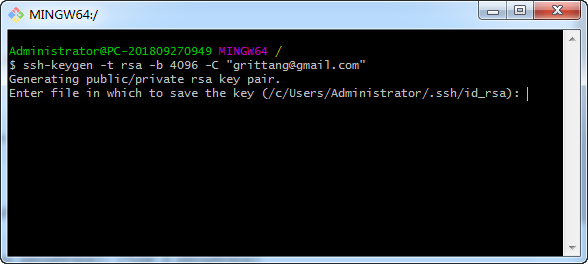
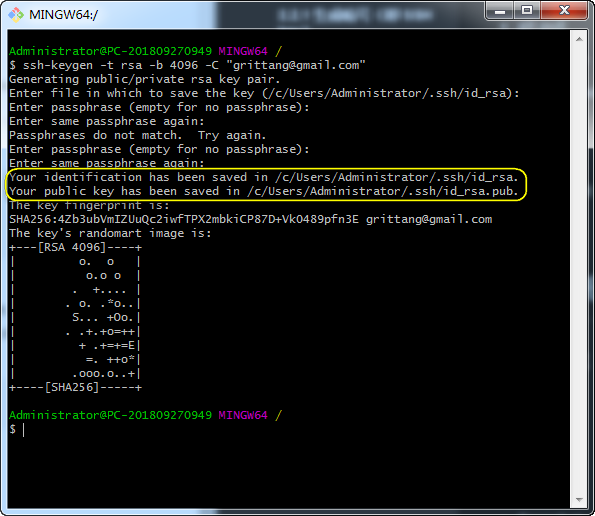
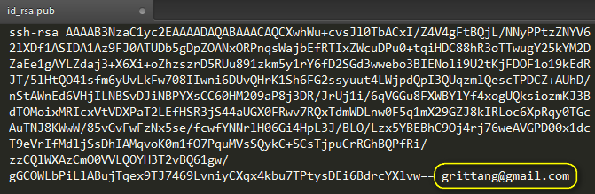
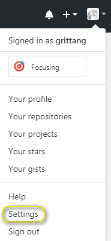
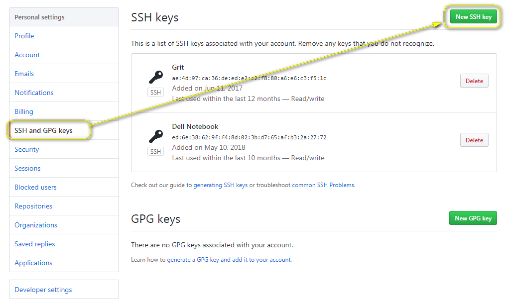
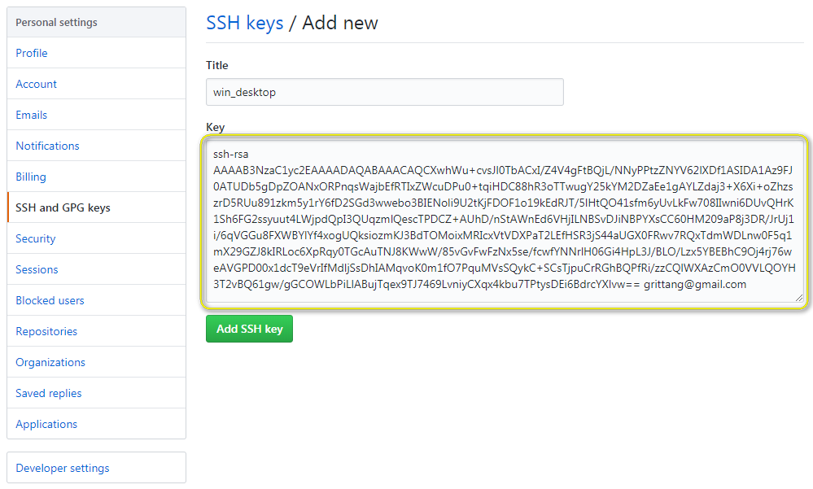
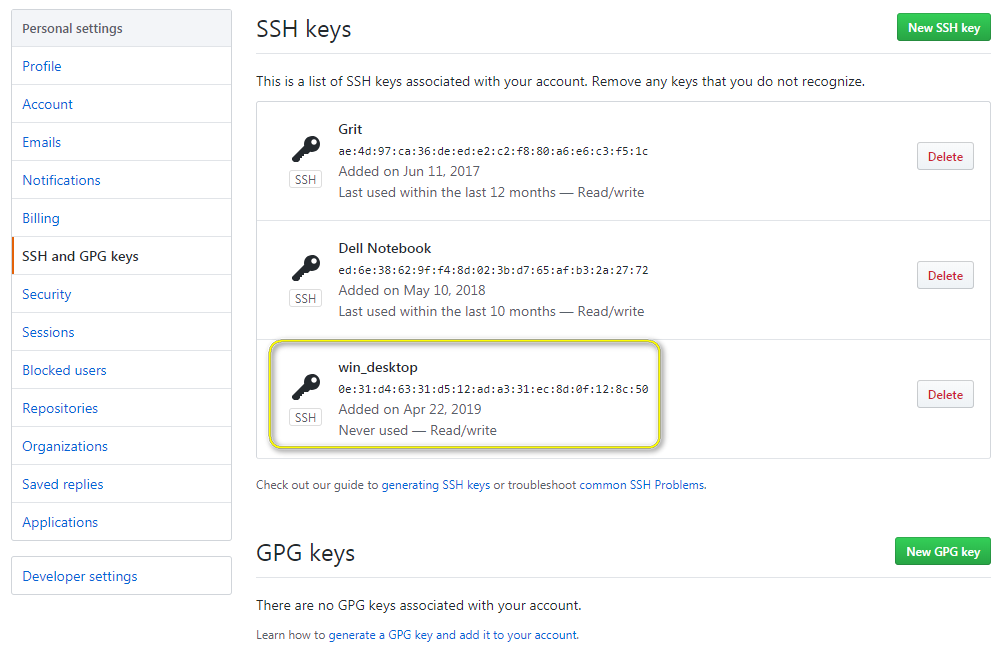

# 安装 Git (Windows 平台)

首先下载 [Git for Windows](<https://gitforwindows.org/>)，安装过程中一路默认“下一步”就行。安装之后，就需要**打通本地电脑直连 GitHub 的任督二脉（账户层面），让 Git/GitHub 认出本地库是谁**啦！ 

什么？到这个节骨眼上了，你还没有 GitHub 账户？[赶紧注册一个吧~](<https://github.com/join?source=header-home>)

> 打通 GitHub 账户的任督二脉有啥用呢？让你掌握直通 GitHub 服务器的“专属热线”，也就是在本地电脑上码字敲代码，就可以远程更新到 GitHub。这种连接是通过**密钥配对**（即公钥/私钥配对）完成的，说人话么~~~就是事先约定好一个接头暗号，当咱们报山头的时候，GitHub 就知道“原来是自己人啊！”
>
> 认出“自己人”有两种接头方式：
>
> 1. **一次性懒人式（用来临时对付）**：每次接头时都需要输入账号和密码信息；
> 2. **长久懒人式（用于长久拥有）**：开头先花点功夫，向服务器申请“护照”，这样往后就大大减少输入账号和密码的次数了。如果你在自己常用的电脑上，强推这种方式！

## 1 一次性懒人式

每次推送到 repo 时，输入命令 `git config --global user.name "your_ame"`, 注意将 `"your_ame"` 替换成你的 ID 。

接着需要验证邮箱：输入命令 `git config --global user.email "your_email@example.com"`,  注意把 `"your_email@example.com"` 替换成你的注册邮箱。

最后输入账户密码。

## 2 长久懒人式（强推）

#### 2.1 生成暗号（即 SSH key）

- 打开 Git Bash（在你安装完 Git 软件后就有这个啦）

- 生成暗号，并且把你注册 GitHub 的邮箱作为 label（注意把 `"your_email@example.com"` 替换成你的注册邮箱）:

  `ssh-keygen -t rsa -b 4096 -C "your_email@example.com"`

- 输入上面的命令行后，敲回车键，出现下面的界面，提示咱们创建一个文件把暗号记下来，默认存储路径已经给出了，也就是 <C:\Users\Administrator\.ssh\>，继续敲回车键：

  

- 接着提示咱输入 GitHub 账户的密码（注意输入密码时不会显示密码，也没有 * 等等符号，但是这个时候确实在输入，就当是“盲输”吧）。

- 输入第一遍密码后，会要求再输入一遍（如果验证不通过，会报错）。验证通过后应该是下面这个界面，注意看图中提示已经保存成功：

  

#### 2.2 添加 SSH key 到 ssh-agent

> 这一步就好比在说“喂，服务器同学，暗号已经设定好了，有这个暗号的才是自己人哦！”

- 启动 ssh-agent

  输入命令`eval $(ssh-agent -s)`，出现如下界面：

  

- 添加 SSH key

  输入命令`ssh-add ~/.ssh/id_rsa`，回车后提示输入账号密码，验证通过后显示添加成功：

  

#### 2.3 添加 SSH key 到 GitHub 账户

> 到现在为止，ssh-agent 和本地电脑都已经懂得这个暗号了，接下来就差告诉 GitHub 了。

- 复制暗号内容

  输入命令复制暗号`clip < ~/.ssh/id_rsa.pub`，或者用文本编辑器（如记事本）打开 id_rsa.pub 这个文件后 Ctrl + C 也可以，这里就让咱们怀着猛烈的好奇心看看暗号的真面目吧，注意看结尾是自己的邮箱账号：

  

- 把暗号告诉 GitHub

  - 登录 GitHub 后，点击右上角进入账户设置：

    

  - 点击 "SSH and GPG keys"后，再点击右上角“New SSH key":

    

  - 粘贴暗号内容，并且给使用这个暗号取个名字吧，最后“Add SSH key"（因为一个 GitHub 账号可能对应多个终端，比如公司电脑和私人电脑，这个名字可以让咱们认出来是哪个终端使用了哪个暗号，方便管理）：

    

  - 这时再按照提示输入密码，验证通过后可以看到新增加的暗号：

    

（完）

相关链接：[[入门教程] 手把手教你玩 Git/GitHub]([Tutorial]Getting_Started_With_Git&GitHub.md)

